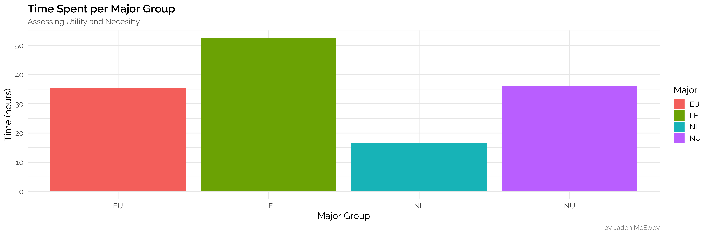
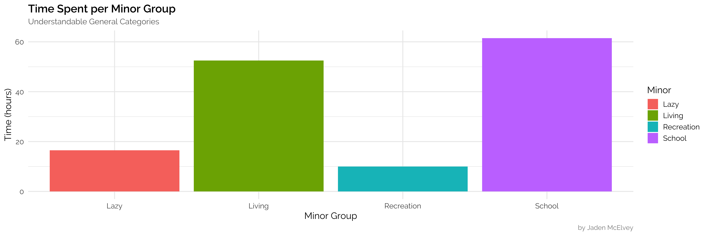
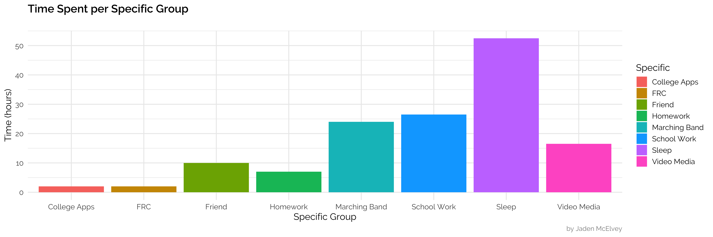

# 1 September 2018
## Major Group x Time

## Minor Group x Time

## Specification x Time

---

#### Notes
Shifted two using hours on the y-axis instead of seconds. It's easier to comprehend relative to the week.